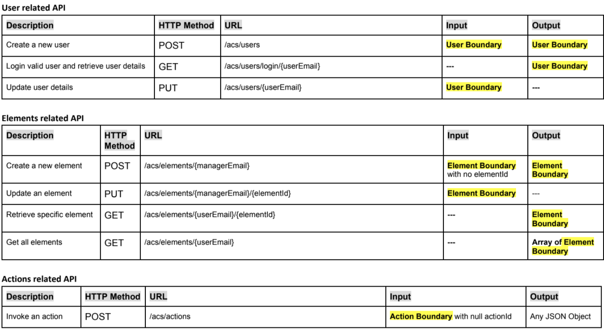
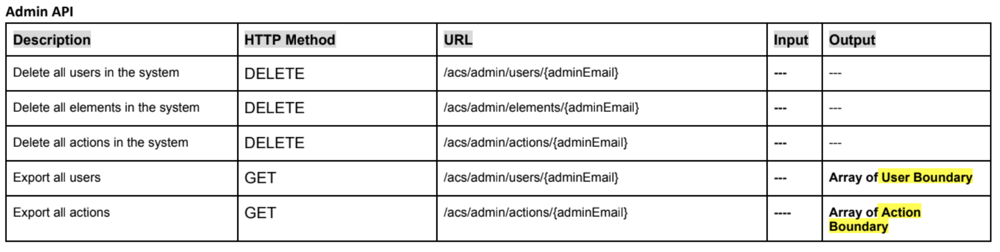
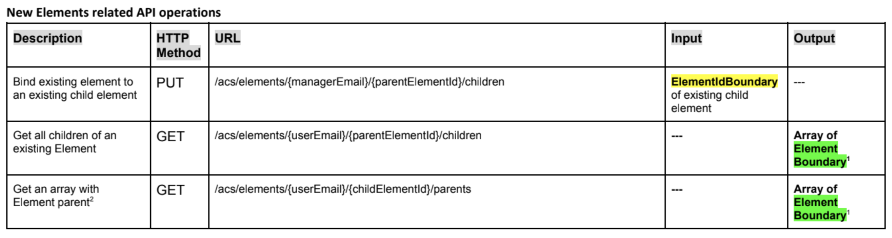
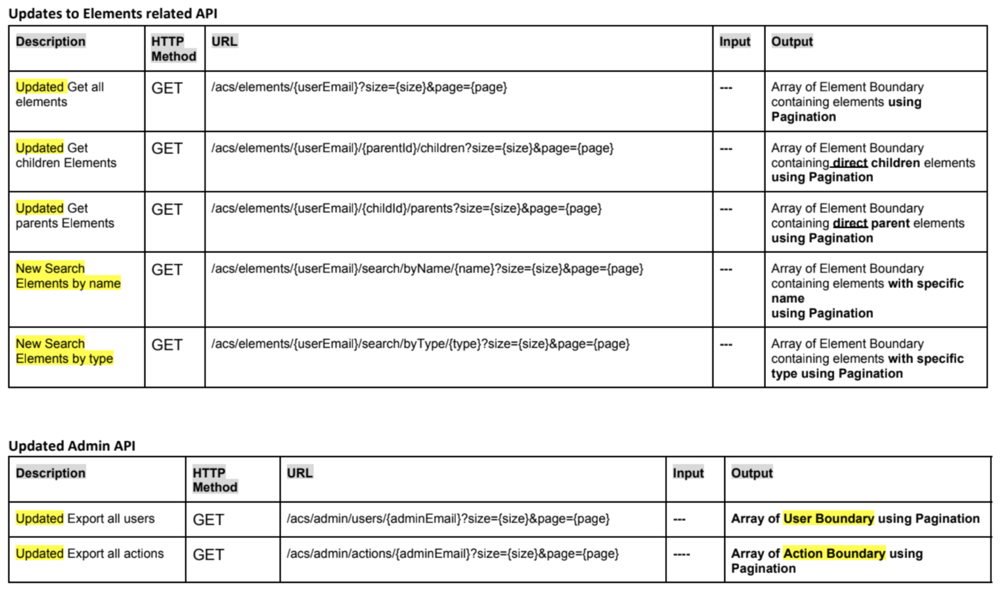

# FastGood

## About:
The project name is “FastGood”.
FastGood is mapping fast food restaurants, on Google map.
Our vision is - to make it easy for people to find their favorite junk food restaurant as quickly and easily as possible.

This project was developed in JAVA programming language.

In the database we used postgreSQL.
In creating the UI we used a Flutter environment with a Dart programming language.

## Required technologies:
* JAVA 1.8
* Maven 4.0.0
* Flutter 1.18.0-11.1
* Dart 2.9.0
* PostgreSQL 6.4 

## API:

## Testing:
In the src folder, there are automated tests with JUnit.
### Example
